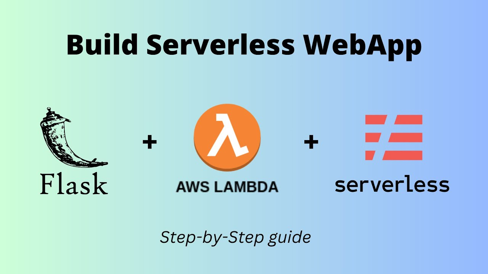

## Serverless 
This project uses [serverless framework](https://www.serverless.com) to deploy lambda. 
Install serverless from [this](https://www.serverless.com/framework/docs/install-standalone) guide.
version uses;
```commandline
Framework Core: 3.29.0 (standalone)
Plugin: 6.2.3
SDK: 4.3.2
```

## Watch on YouTube

https://youtu.be/UURk-lLupgc?si=TNQAwt5_xZLbGlsM

## Install dependencies 
re-open the terminal to use serverless command. 

install npm 

```js
sudo yum update
sudo yum install nodejs
npm install

sudo yum install python3-pip
pip install -r requirements.txt
```

## Deploy

Now it's time to deploy the main lambda function that will server online-tools webpage. The serverless 
config is placed in repository root page `serverless.yaml`. Before deploying lambda, make sure to install 
required plugins

```commandline
serverless plugin install -n serverless-wsgi
serverless plugin install -n serverless-python-requirements
```
_NOTE: be sure pip default index-url is `https://pypi.python.org/simple`_

Now run following command to deploy lambda
```commandline
serverless deploy
```

